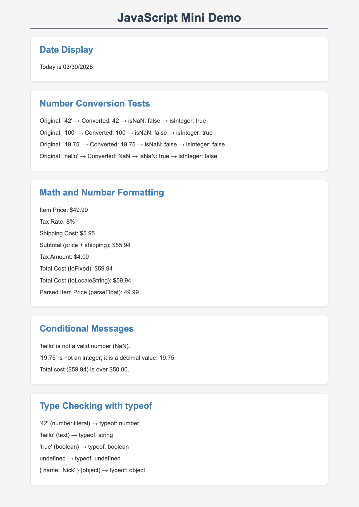

# Comp484-hw9 — JavaScript Mini Demo

## GitHub Pages

[Live Site](https://nickbalint.github.io/Comp484-hw9/)

## Screenshot

## Built-In Objects and Methods Used

### `Date` Object
- `new Date()` — creates a Date object for the current date/time
- `getMonth()` — returns the month (0-based)
- `getDate()` — returns the day of the month
- `getFullYear()` — returns the four-digit year

### `Number` Object / Methods
- `Number()` — converts a value to a number
- `Number.isNaN()` — checks whether a value is NaN
- `Number.isInteger()` — checks whether a value is an integer
- `Number.parseFloat()` — parses a string and returns a floating-point number
- `.toFixed(n)` — formats a number to n decimal places
- `.toLocaleString()` — formats a number using locale-specific conventions

### Conditional Logic
- `if/else` statements based on NaN checks, integer checks, and value comparisons

## Reflection

The easiest part of the assignment was Part 1 (Date Display) because working with the `Date` object is straightforward once you remember that months are zero-based. The hardest part was Part 3 (Math and Formatting) because choosing the right formatting methods and making sure the arithmetic was accurate required careful attention. I learned that the `Date` object's month is zero-indexed, which means you always need to add 1 when displaying the month to a user. From the `Number` object I learned the difference between `Number.isNaN()` and the global `isNaN()`—the `Number` version is stricter and only returns `true` for actual NaN, not for non-numeric strings coerced to NaN before the check. I also learned that injecting content into the DOM using `innerHTML` or `textContent` is a clean way to display dynamic JavaScript results without needing server-side rendering.

